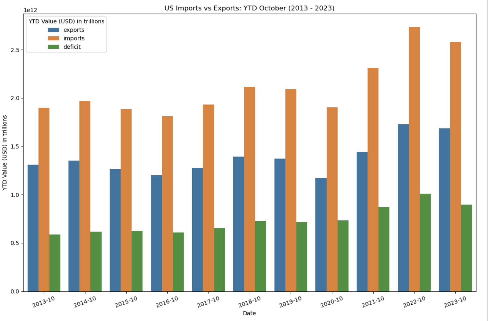

# Exploring US Import & Export Data with the Census API

This project explores US import and export data utilizing the Census API. The Census API grants access to a broad range of datasets related to imports and exports.

## API Access

Access the Census API at [Census Data Sets](https://www.census.gov/data/developers/data-sets.html).
Sign up for an API key [Census API Key Request](https://api.census.gov/data/key_signup.html).

## Dependencies

- `python`
- `pandas`
- `requests`
- `hvplot`
- `dotenv`
- `geopy`
- `matplotlib`
- `seaborn`

## Key Questions Explored

This project aims to address fundamental queries concerning US import and export data:

1. **What is the US Trade Deficit between imports and exports?**
2. **What are the top US ports for imports and exports?**
3. **What are the top products imported and exported?**
4. **What are the top US trading partners for imports and exports?**

## US Trade Deficit

**API Used**: porths  
**Link**: [Census API - US Trade Deficit](https://api.census.gov/data/timeseries/intltrade/exports/porths/variables.html)

Examining year-to-date total values of imports and exports from October 2013 through October 2023, the average deficit stood at $731.04 billion. Notably, the deficit fluctuated between $586.51 billion (October 2013) and $1.01 trillion (October 2022). While the deficit has generally increased over the last decade, it decreased compared to the previous year in the years 2016, 2019 and 2023.

Further in-depth analysis could involve quantifying these trends against influential factors like policy changes and social events.

A visualization of US imports, exports and the calculated trade deficit:

## US Port Imports

**API Used**: porths  
**Link**: [Census API - US Port Imports](https://api.census.gov/data/timeseries/intltrade/exports/porths/variables.html)

Reviewing the annual import values over the past decade, Los Angeles, CA leads with an import value of $2.76 trillion.

The top 10 list surprisingly includes ports like Detroit, MI, Savannah, GA, and New Orleans, LA.

Top 10 List:
| PORT | PORT_NAME                   | GEN_VAL_YR     |
|------|-----------------------------|----------------|
| 182  | LOS ANGELES, CA             | 2.757943e+12   |
| 62   | NEWARK, NJ                  | 1.883582e+12   |
| 352  | CHICAGO, IL                 | 1.770119e+12   |
| 153  | LAREDO, TX                  | 1.366580e+12   |
| 64   | JFK INTERNATIONAL AIRPORT, NY| 1.186959e+12   |
| 406  | HOUSTON, TX                 | 7.740045e+11   |
| 332  | DETROIT, MI                 | 7.662375e+11   |
| 102  | SAVANNAH, GA                | 7.634869e+11   |
| 184  | LONG BEACH, CA              | 7.504660e+11   |
| 128  | NEW ORLEANS, LA             | 6.889729e+11   |

Further analysis involved examining the top commodities imported into the leading port. The top result was *ELECTRICAL MACHINERY AND EQUIPMENT AND PARTS THEREOF; SOUND RECORDERS AND REPRODUCERS, TELEVISION RECORDERS AND REPRODUCERS, PARTS AND ACCESSORIES* with an import value of $4.75 billion.

Additionally, we explored the top countries from which imports were made into the leading port:

## Geo Data

As the Census API does not provide geo data, we utilized the `geopy` Python library and its implementaion for the `Nominatim` service. Utilizing `PORT_NAME` and `CTY_NAME` properties, we fetched latitude and longitude data.

While most port names were structured as *[city], [st]*, providing accurate geolocation data for countries might require a more robust mapping system. Here are visual representations of US ports and global locations:

